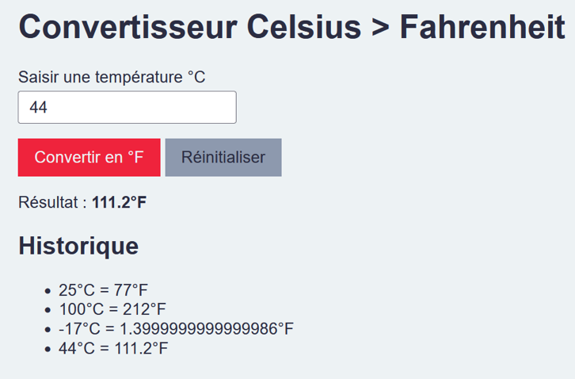

# JS - Exercice Celsius > Fahrenheit
## Etape 1 - Fahrenheit avec prompt

Écrivez un programme qui demande à l’utilisateur de saisir une température en degrés Celsius,
puis la convertit et l'affiche en degrés Fahrenheit.

Si l'utilisateur ne saisit pas un nombre, afficher un message d'erreur.


1. Récupérer le dépôt de l’exercice sur votre ordinateur et l’ouvrir dans 
   votre éditeur de code (WebStorm).
1. Modifier le code du fichier`js/main.js` pour réaliser l'exercice.
1. Envoyer votre exercice : faire un `commit` et un `push` sur la branche 
   `main`.

La formule de conversion est la suivante :

```
[°F] = [°C] x 9 / 5 + 32
```
## Etape 2 - Fahrenheit avec formulaire

Réaliser l'étape 1 avec un formulaire en remplacement du prompt.

---



### Instructions
>Créer une nouvelle branche `etape2-nom-prenom`.

#### 1. Dans le HTML `index.html`
1. Créer un formulaire `<form id="convertisseur"></form>`
2. Dans le formulaire, ajouter :
   * un champ texte `<input type="text" id="celsius">` pour la saisie
      de la température en °C 
   * un bouton d'envoi `<button type="submit">Convertir en °F</button>`
3. Après le formulaire, ajouter un paragraphe qui affichera le résultat dans un 
   span `<p>Résultat : <span id="fahrenheit"></span> °F</p>`

#### 2. Dans le JavaScript `main.js`

1. Récupérer les éléments HTML (champ texte, bouton, span)
2. À l'envoi du formulaire, événement `submit` :
   1. Récupérer la valeur saisie par l'utilisateur dans le champ texte
   2. Convertir la valeur en nombre
   3. Si la valeur n'est pas un nombre, afficher un message d'erreur
   4. Sinon, convertir la température en °F
   5. Injecter la valeur en °F dans le span avec `.innerText`
   6. Vider le champ texte avec `.value = ''`

#### 3. Créer un historique
1. Après le paragraphe, ajouter une liste vide `<ul id="historique"></ul>`
2. Dans le JavaScript, créer un `<li>` en utilisant `.innerHTML`, pour chaque 
   conversion réalisée par l'utilisateur. Ex: `<li>12°C = 53.6°F</li>`

#### 4. Ajouter un bouton pour effacer l'historique
1. Après le bouton d'envoi, ajouter un bouton _Réinitialiser_
   `<button id="effacer">Réinitialiser</button>`
2. Dans le JavaScript, ajouter un écouteur d'événement `click` sur le bouton
   1. vider la liste avec `.innerHTML = ''`
   2. vider le span avec `.innerText = ''`
   3. vider le champ texte avec `.value = ''`

## La doc...
* [Variables et constantes](https://divtec.gitbook.io/javascript/javascript/introduction/variables-et-constantes#declarer-des-variables-et-constantes)
* [Interactions avec l'utilisateur](https://divtec.gitbook.io/133a/javascript/introduction/interactions-avec-lutilisateur)
* [Convertir une chaîne de caractères en nombre](https://divtec.gitbook.io/javascript/javascript/introduction/conversions#convertir-une-chaine-de-caracteres-en-nombre)
* [Envoyer des formulaires](https://divtec.gitbook.io/javascript/javascript/formulaires/capter-lenvoi-du-formulaire)
* [Récupérer et modifier la valeur des champs](https://divtec.gitbook.io/javascript/javascript/formulaires/recuperer-la-valeur-des-champs)
* [Modifier les contenus textes](https://divtec.gitbook.io/javascript/javascript/dom-introduction/dom-modifier-texte)

