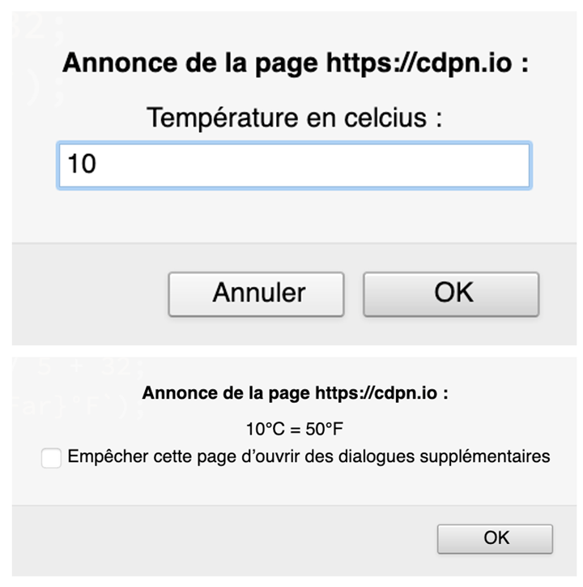

# JS - Exercice Celsius > Fahrenheit
## Etape 1 - Fahrenheit avec prompt

Écrivez un programme qui demande à l’utilisateur de saisir une température en degrés Celsius,
puis la convertit et l'affiche en degrés Fahrenheit.

Si l'utilisateur ne saisit pas un nombre, afficher un message d'erreur.


1. Récupérer le dépôt de l’exercice sur votre ordinateur et l’ouvrir dans 
   votre éditeur de code (WebStorm).
1. Modifier le code du fichier`js/main.js` pour réaliser l'exercice.
1. Envoyer votre exercice : faire un `commit` et un `push` sur la branche 
   `main`.

La formule de conversion est la suivante :

```
[°F] = [°C] x 9 / 5 + 32
```
## Etape 2 - Fahrenheit avec formulaire


Réaliser l'étape 1 avec un formulaire en remplacement du prompt.

### Instructions

>Créer une nouvelle branche "etape2-nom-prenom".

#### 1. Dans le HTML `index.html`
1. Ajouter un champ texte `<input type="text" id="celsius">` pour la saisie
   de la température en °C
1. Ajouter un bouton `<button id="convert">Convertir en °F</button>`
1. Ajouter un paragraphe qui affiche le résultat dans un span
   `<p>Résultat : <span id="fahrenheit"></span> °F</p>`

#### 2. Dans le JavaScript `main.js`
1. Récupérer les éléments HTML (champ texte, bouton, span)
1. Au click du bouton "Convertir en °F"
   1. Récupérer la valeur saisie par utilisateur dans le champ texte
   1. Afficher un message d'erreur si ce n'est pas un nombre
   1. Injecter le résultat dans le span avec `.innerText`

#### 3. Créer un historique
1. Ajouter une liste `<ul id="historique">` dans le html
1. Dans le JavaScript, créer un <li> pour chaque conversion réalisée par
   l'utilisateur

## La doc...
* [Variables et constantes](https://divtec.gitbook.io/javascript/javascript/introduction/variables-et-constantes#declarer-des-variables-et-constantes)
* [Interactions avec l'utilisateur](https://divtec.gitbook.io/133a/javascript/introduction/interactions-avec-lutilisateur)
* [Convertir une chaîne de caractères en nombre](https://divtec.gitbook.io/javascript/javascript/introduction/conversions#convertir-une-chaine-de-caracteres-en-nombre)

